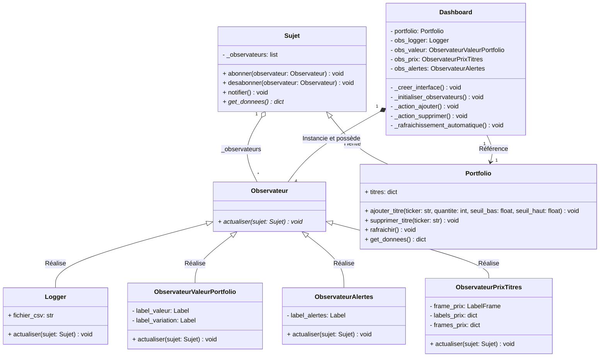

```mermaid
classDiagram
    direction TB
    
    %% --- CLASSES ABSTRAITES DE BASE ---
    class Sujet {
        - _observateurs: list
        + abonner(observateur: Observateur) void
        + desabonner(observateur: Observateur) void
        + notifier() void
        + get_donnees()* dict
    }

    class Observateur {
        + actualiser(sujet: Sujet)* void
    }

    %% --- SUJET CONCRET ---
    class Portfolio {
        + titres: dict
        + ajouter_titre(ticker: str, quantite: int, seuil_bas: float, seuil_haut: float) void
        + supprimer_titre(ticker: str) void
        + rafraichir() void
        + get_donnees() dict
    }

    %% --- OBSERVATEURS CONCRETS ---
    class Logger {
        + fichier_csv: str
        + actualiser(sujet: Sujet) void
    }

    class ObservateurValeurPortfolio {
        - label_valeur: Label
        - label_variation: Label
        + actualiser(sujet: Sujet) void
    }

    class ObservateurAlertes {
        - label_alertes: Label
        + actualiser(sujet: Sujet) void
    }

    class ObservateurPrixTitres {
        - frame_prix: LabelFrame
        - labels_prix: dict
        - frames_prix: dict
        + actualiser(sujet: Sujet) void
    }

    %% --- VUE ET INTERFACE ---
    class Dashboard {
        - portfolio: Portfolio
        - obs_logger: Logger
        - obs_valeur: ObservateurValeurPortfolio
        - obs_prix: ObservateurPrixTitres
        - obs_alertes: ObservateurAlertes
        - _creer_interface() void
        - _initialiser_observateurs() void
        - _action_ajouter() void
        - _action_supprimer() void
        - _rafraichissement_automatique() void
    }

    %% --- RELATIONS ET HÉRITAGE ---
    Sujet <|-- Portfolio : Hérite
    Observateur <|-- Logger : Réalise
    Observateur <|-- ObservateurValeurPortfolio : Réalise
    Observateur <|-- ObservateurAlertes : Réalise
    Observateur <|-- ObservateurPrixTitres : Réalise

    Sujet "1" o-- "*" Observateur : _observateurs
    Dashboard "1" --> "1" Portfolio : Référence
    Dashboard "1" *-- "4" Observateur : Instancie et possède
```